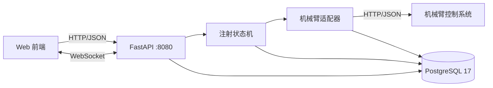

# 机械臂猪只背部注射系统 · 后端

护栏内机械臂给猪只背部自动注射的**指令网关 + 数据落库 + 接口契约**服务。
双摄像头方案（护栏相机 + 臂上相机）提供定位，机械臂控制由第三方外包，本服务是
**前端与机械臂之间唯一的通道**。

> 一句话架构：**前端只连后端，后端是机械臂指令的唯一出口，所有动作与结果都落库。**



## 特性

- **指令网关**：所有下发指令走同一条通道，自带幂等（`request_id`）、审计、错误归一。
- **注射状态机**：`created → queued → locating → aligning → inserting → injecting → retracting → completed`，
  每个阶段都有独立耗时统计与时间线事件。
- **实时推送**：WebSocket 广播机械臂状态、指令回执、注射阶段、避障事件，前端不必高频轮询。
- **遥测落库**：每 1 秒采集机械臂状态、心跳、热成像帧，供回放、报表与论文使用。
- **可替换的机械臂适配器**：`ARM_DRIVER=mock|http` 一键切换，字段差异只出现在一个文件里。
- **无硬件可开发**：内置 Mock 机械臂，前端拿不到真机也能全流程联调。

## 快速开始

```powershell
# 1) 起数据库（便携版 PostgreSQL 17，端口 55432，详见 docs/03_快速开始.md）
powershell -ExecutionPolicy Bypass -File backend\scripts\pg_start.ps1

# 2) 建表 + 种子数据
cd backend
uv sync
uv run python scripts/init_db.py

# 3) 起服务
uv run uvicorn app.main:app --host 0.0.0.0 --port 8080 --reload
```

- 接口文档（可直接在线调试）：http://127.0.0.1:8080/docs
- 健康检查：http://127.0.0.1:8080/api/v1/health

有 Docker 的机器更简单：

```bash
docker compose up -d
```

## 自检

```powershell
cd backend
uv run pytest -q                        # 单元测试
uv run python scripts/smoke_test.py     # 端到端冒烟：42 项断言，覆盖完整注射流程与急停链路
uv run ruff check app scripts tests     # 静态检查
```

## 文档

| 文档 | 读者 | 内容 |
|---|---|---|
| [docs/04_接口契约与数据字典_交付版.md](docs/04_接口契约与数据字典_交付版.md) | 全体 | **唯一口径**：接口契约 + 17 张表字段明细 + 机械臂回传要求 |
| [docs/01_数据字典与机械臂回传参数规格.md](docs/01_数据字典与机械臂回传参数规格.md) | 外包方 / 后端 | 逐字段索要清单与落库位置 |
| [docs/02_后端接口契约_v1.md](docs/02_后端接口契约_v1.md) | 前端 | 接口清单、错误码、WebSocket、页面映射 |
| [docs/03_快速开始.md](docs/03_快速开始.md) | 全体 | 起库、起服务、常见问题 |

## 目录结构

```
backend/
├── app/
│   ├── main.py            服务入口、CORS、统一异常处理
│   ├── config.py          配置（.env）
│   ├── db.py              引擎与会话
│   ├── models.py          17 张表，表结构唯一权威
│   ├── schemas.py         请求/响应模型
│   ├── api/               HTTP 路由（system/devices/arm/injection/perception/catalog/alarms/media/reports/ws）
│   └── services/
│       ├── arm_gateway.py 机械臂适配器（Mock / Http）
│       ├── commands.py    统一指令通道：幂等 + 审计 + 广播
│       ├── injection.py   注射状态机
│       ├── telemetry.py   1 秒遥测轮询与落库
│       ├── alarms.py      告警判定与去重
│       ├── media.py       媒体文件存取
│       ├── ws.py          WebSocket 广播中心
│       └── registry.py    适配器注册表
├── scripts/               建表、导 DDL、冒烟测试、PG 启停
├── sql/schema.sql         由 dump_schema.py 自动导出，勿手改
└── tests/                 pytest
docs/                      接口契约与数据字典
```

## 切换到真实机械臂

```ini
# backend/.env
ARM_DRIVER=http
ARM_BASE_URL=http://<机械臂控制服务IP>:<端口>
ARM_PATH_STATUS=/api/arm/status
# ... 其余 ARM_PATH_* 按外包方文档填写
```

字段名不一致时，只需在 `backend/app/services/arm_gateway.py::HttpArmAdapter` 加映射，
业务代码与前端零改动。

## 注意

- v1 **没有鉴权**，只允许部署在可信局域网，不要直接暴露公网。
- `backend/.env` 里的是开发用凭据，正式部署前必须更换。
- 遥测表按 `TELEMETRY_RETENTION_DAYS`（默认 30 天）滚动清理；注射记录与审计记录永久保留。
