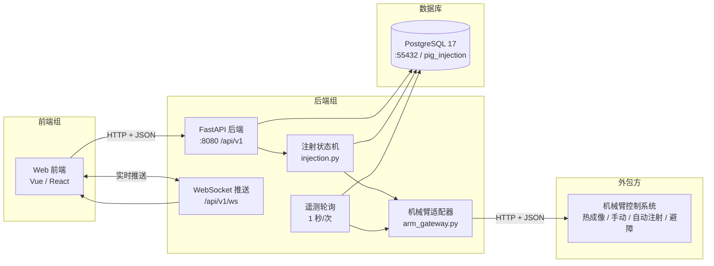

# 机械臂猪只背部注射系统 · 接口契约与数据库数据字典

**版本 v1.0 · 交付日期 2026-09-17 · 负责方：后端组**

| 项 | 值 |
|---|---|
| 后端仓库路径 | `pig_injection_platform/backend` |
| 服务地址（开发） | `http://<服务器IP>:8080` |
| 接口前缀 | `/api/v1` |
| 在线接口文档 | `http://<服务器IP>:8080/docs`（Swagger，可直接点 Try it out 联调） |
| 机器可读规范 | `http://<服务器IP>:8080/openapi.json` |
| 数据库 | PostgreSQL 17，库 `pig_injection`，17 张业务表 |
| 表结构权威来源 | `backend/app/models.py` → 导出 `backend/sql/schema.sql` |
| 本文档阅读对象 | 前端组（第 1 章）、数据库/答辩材料（第 2 章）、外包机械臂方（第 3 章） |

> 本文档是**唯一的接口与数据口径**。与本文档冲突的旧文档、口头约定一律以本文档为准。
> 变更流程：任何一方要改接口，先提改动点 → 后端更新本文档版本号 → 双方按新版本联调。

---

## 第 0 章 系统边界与分工

### 0.1 总体架构



### 0.2 为什么前端不直连机械臂

| 理由 | 说明 |
|---|---|
| 安全 | 机械臂是带电、带针、有夹伤风险的设备。指令必须经过后端的急停互锁与参数校验，不能由浏览器直接触发。 |
| 审计 | 答辩与事故追溯需要回答"谁、在几时、对哪头猪、下发了什么指令、结果如何"。这条记录只有后端能生成。 |
| 解耦 | 外包方的接口路径、字段名、单位随时可能变。变化被隔离在 `arm_gateway.py` 一个文件里，前端代码不受影响。 |
| 数据留痕 | 注射精度、进针阻力、猪只体温等指标要落库、要能出报表，不属于机械臂的职责。 |
| 实时性 | 前端只连一条 WebSocket，由后端统一广播状态，比多个页面各自轮询机械臂更省带宽、更不易卡。 |

### 0.3 职责边界（谁负责什么）

| 能力 | 前端 | 后端 | 外包机械臂 |
|---|---|---|---|
| 页面渲染、交互、图表 | ✅ | | |
| 指令下发鉴权、幂等、审计 | | ✅ | |
| 注射流程状态机与进度 | | ✅ | 只执行动作、回报阶段 |
| 目标点定位算法（视觉） | | 暂缺（由外包方或视觉组提供 `target_point`） | 可选 |
| 关节级运动控制、力控 | | 只做转发 | ✅ |
| 热成像测量与伪彩图生成 | | 存储、统计、报表 | ✅ |
| 急停 | 提供大按钮 | 幂等转发 + 状态互锁 | ✅ 真正断电 |
| 告警判定（体温异常、电机过温） | 展示 | ✅ 判定与去重 | 上报原始值 |

### 0.4 技术栈

| 层 | 选型 | 说明 |
|---|---|---|
| 语言 | Python 3.13 | 后端统一 Python |
| Web 框架 | FastAPI + Uvicorn | 自带 OpenAPI，`/docs` 可直接联调 |
| ORM | SQLAlchemy 2.0 | `models.py` 即表结构权威 |
| 驱动 | psycopg 3 | `postgresql+psycopg://` |
| 数据库 | PostgreSQL 17 | jsonb 存关节数组、原始报文，方便答辩展示 |
| 包管理 | uv | `uv sync` / `uv run` |
| 测试 | pytest + 自研冒烟脚本 | 26 单测 + 42 项端到端断言 |
| 实时通道 | 原生 WebSocket | 无需额外 MQ |
---

## 第 1 章 接口契约（前端组必读）

### 1.1 通用约定

| 项 | 约定 |
|---|---|
| 协议 | HTTP/1.1 + HTTPS（正式部署建议挂 Nginx 加 TLS） |
| Base URL | `http://<服务器IP>:8080` |
| 统一前缀 | `/api/v1`，本文档后续路径省略该前缀 |
| 请求体 | `Content-Type: application/json`（媒体上传除外，用 `multipart/form-data`） |
| 时间格式 | ISO 8601 带时区偏移，如 `2026-09-17T22:40:43.400834+08:00`，时区固定 `Asia/Shanghai` |
| 字段命名 | 全部 `snake_case` |
| 长度单位 | 一律 **mm**；角度一律 **deg**；温度一律 **℃**；力 **N**、力矩 **N·m**；剂量 **ml** |
| 跨域 | 后端已开启 CORS，开发期允许全部来源；正式环境在 `.env` 的 `CORS_ORIGINS` 收敛 |
| 鉴权 | **v1 没有鉴权**，只允许部署在可信局域网。不要直接暴露到公网 |
| 缓存 | 所有 JSON 响应带 `Cache-Control: no-store` |
| 分页 | `?limit=&offset=`，响应统一为 `{"ok":true,"page":{"total":N,"limit":L,"offset":O},"items":[...]}` |

#### 1.1.1 幂等键 `request_id`（最容易踩的坑）

**所有写操作都建议带 `request_id`**（任意字符串，推荐 UUID；非 UUID 后端会哈希成稳定键）。

后端保证：相同 `request_id` 重复提交，**只会向机械臂下发一次**，第二次直接返回第一次的结果，
`message` 字段会提示"重复请求"。

这条约定解决三个真实问题：

1. 用户双击"开始注射"按钮 → 机械臂打两针；
2. 网络超时后前端自动重试 → 指令重复；
3. 页面刷新导致请求重发。

```js
// 前端统一封装：所有 POST 都这么发
async function post(path, body, base = 'http://127.0.0.1:8080/api/v1') {
  const res = await fetch(base + path, {
    method: 'POST',
    headers: { 'Content-Type': 'application/json' },
    body: JSON.stringify({ ...body, request_id: crypto.randomUUID() }),
  });
  return res.json();
}
```

> 不传 `request_id` 也能调通（后端会自动生成一个），但就**失去了防重能力**，只适合调试。

#### 1.1.2 控制类接口的三条纪律

1. 一律 `POST`，不要用 `GET` 触发动作（浏览器/代理会预取，可能误触发）。
2. **不要**在 `fetch` 层做自动重试；重试由用户操作触发（有 `request_id` 时重试是安全的）。
3. 急停按钮**不要二次确认弹窗**，也不要做防连点，急停要快要无脑。

#### 1.1.3 控制类响应的统一格式

所有 `/arm/*`、`/injection/tasks/{id}/abort` 等控制接口，成功时统一返回：

```json
{
  "request_id": "92a891fe-6d2f-4f26-9a2c-6e46a5a1b2f3",
  "command_type": "jog",
  "accepted": true,
  "result": "success",
  "arm_command_id": "JOG-1789656000123",
  "message": null,
  "duration_ms": 3,
  "response": { "accepted": true, "motion_done": true }
}
```

| 字段 | 说明 |
|---|---|
| `accepted` | 机械臂是否受理。`false` 时请看 `message` 和顶层 `error` |
| `result` | `success` / `rejected` / `timeout` / `error` |
| `arm_command_id` | 机械臂侧指令号，用于和机械臂日志对账 |
| `duration_ms` | 本次转发到机械臂的往返耗时，可用来观察网络抖动 |
| `response` | 机械臂原始返回，字段随机械臂而定，前端**不要依赖**其内部结构 |

### 1.2 统一错误响应与错误码表

所有错误（含 404、422）都是同一个形状：

```json
{
  "ok": false,
  "error": "estop_active",
  "message": "急停状态下不接受运动指令",
  "request_id": "df1ebf4e-2a08-443c-b230-e72a4870a296"
}
```

前端请**只按 `error` 做分支**，`message` 只用于展示，不要用中文文案做判断条件。

| HTTP | `error` | 触发场景 | 前端应该做什么 |
|---|---|---|---|
| 400 | `bad_request` | 参数缺失或非法 | 提示用户，不改状态 |
| 400 | `bad_axis` | 点动轴不在 `x/y/z/j1..j6` | 修前端参数 |
| 400 | `bad_mode` | 模式不在 `idle/manual/auto` | 修前端参数 |
| 404 | `not_found` | 任务/猪只/栏位/设备/告警不存在 | 刷新列表 |
| 404 | `device_not_found` | 台账里没有该机械臂设备 | 先去设备页登记 |
| 409 | `estop_active` | **急停未复位** | 弹红色警告，引导去急停复位 |
| 409 | `arm_fault` | 机械臂故障 | 弹红色警告并显示 `message` |
| 409 | `injection_busy` | 已有注射任务在执行 | 提示等待，或让用户去中止 |
| 409 | `arm_rejected` | 机械臂拒绝执行 | 显示 `message` |
| 409 | `conflict` | 编号/耳标/用户名重复 | 提示换一个 |
| 422 | `validation_error` | Pydantic 参数校验失败，`message` 里会指出具体字段 | 开发期 bug，看 `message` |
| 500 | `internal_error` / `path_not_configured` | 后端异常 / 未配机械臂路径 | 报错给后端组 |
| 501 | `unsupported` | 当前机械臂不支持该功能 | 按钮置灰 |
| 502 | `arm_bad_response` | 机械臂返回的不是 JSON | 报错给后端组 |
| 503 | `arm_unreachable` | 连不上机械臂服务 | 页面挂"设备离线"角标 |
| 504 | `arm_timeout` | 机械臂响应超时（默认 8 秒） | 提示重试；**先查状态再决定是否重发** |

### 1.3 WebSocket 实时推送

```
WS ws://<服务器IP>:8080/api/v1/ws
```

连接建好后服务端**立刻推一次当前机械臂状态**，之后持续推送。客户端每 20 秒发一次文本 `ping` 保活，服务端回 `pong`。

所有消息统一为 `{"type": "...", "data": {...}}`：

| `type` | 触发时机 | `data` 内容 |
|---|---|---|
| `arm_status` | 约 1 次/秒（遥测轮询） | 与 `GET /arm/status` 完全一致 |
| `control_command` | 每次指令下发完成 | 与 1.1.3 的控制响应一致 |
| `injection_phase` | 注射阶段切换 | `{task_id, phase}` |
| `injection_task` | 任务进入终态 | `{task_id, status, duration_ms \| reason}` |
| `obstacle` | 避障事件产生 | 避障事件对象（含 `distance_mm`、`action_taken`） |

```js
const ws = new WebSocket('ws://192.168.1.10:8080/api/v1/ws');
ws.onmessage = (e) => {
  const { type, data } = JSON.parse(e.data);
  switch (type) {
    case 'arm_status':      renderArmStatus(data); break;   // 状态条、关节表、TCP 位姿
    case 'control_command': toastCommand(data); break;      // 指令回执
    case 'injection_phase': updateProgressBar(data.phase); break;
    case 'injection_task':  loadTaskDetail(data.task_id); break;
    case 'obstacle':        showObstacleToast(data); break;
  }
};
setInterval(() => ws.readyState === WebSocket.OPEN && ws.send('ping'), 20000);
```

> 不想用 WebSocket 也能跑：注射进度就每 500 ms 轮询 `GET /injection/tasks/{id}`，
> 机械臂状态每 1 s 轮询 `GET /arm/status`。但 WebSocket 更省资源，演示效果也更好。

### 1.4 接口清单（共 49 条路径）

#### 1.4.1 系统（2）

| 方法 | 路径 | 说明 |
|---|---|---|
| GET | `/health` | 健康检查：数据库连通、机械臂驱动类型与在线状态、遥测轮询次数、WS 客户端数 |
| GET | `/overview` | 首页概览：栏位数、猪只数、设备数、今日注射成功/失败、本周注射数、活动告警数、本周避障次数、今日热成像帧数 |

#### 1.4.2 机械臂状态与审计（3）

| 方法 | 路径 | 参数 | 说明 |
|---|---|---|---|
| GET | `/arm/status` | `device_code` | **实时直读机械臂**，含 6 轴角度/力矩/电流/温度、TCP 位姿、 TCP 六维力、模式、安全状态、当前注射阶段 |
| GET | `/arm/status/history` | `device_code`,`limit` | 查库的遥测采样（默认由后端每 1 秒写入一条） |
| GET | `/arm/commands` | `device_code`,`command_type`,`result`,`limit`,`offset` | **指令审计**：谁在何时下发了什么、结果、耗时 |

#### 1.4.3 手动控制（8）

| 方法 | 路径 | 请求体（除公共字段外） | 说明 |
|---|---|---|---|
| POST | `/arm/jog` | `axis`(`x`/`y`/`z`/`j1..j6`)**,** `direction`(`1`/`-1`)、`step`、`speed_pct` | 单步点动 |
| POST | `/arm/move/pose` | `pose{x,y,z,rx,ry,rz}`、`speed_pct`、`frame` | 直线运动到指定位姿 |
| POST | `/arm/move/joint` | `joint_angles_deg[6]`、`speed_pct` | 关节空间运动 |
| POST | `/arm/home` | 无 | 回零 |
| POST | `/arm/stop` | 无 | 暂停/停止当前运动（不切断动力） |
| POST | `/arm/mode` | `mode`(`idle`/`manual`/`auto`) | 切换控制模式 |
| POST | `/arm/estop` | 无 | **急停**：无前置条件、幂等、可连点 |
| POST | `/arm/estop/reset` | 无 | 急停复位（复位后一般还要 `/arm/home`） |

公共字段：`request_id`、`operator_id`、`operator_name`、`device_code`（默认 `ARM-01`）。

#### 1.4.4 自动避障（4）

| 方法 | 路径 | 参数 | 说明 |
|---|---|---|---|
| GET | `/arm/obstacle/status` | `device_code` | `{enabled, active, sensor_type, min_distance_mm, event}` |
| POST | `/arm/obstacle/enabled` | `enabled`(bool) + 公共字段 | 远程开关避障 |
| GET | `/obstacle/events` | `event_type`,`task_id`,`limit`,`offset` | 历史避障事件（分页） |
| GET | `/obstacle/events/{event_id}` | — | 事件详情（含机械臂原始报文 `raw`） |

#### 1.4.5 热成像（4）

| 方法 | 路径 | 参数 | 说明 |
|---|---|---|---|
| GET | `/arm/thermal/latest` | `device_code` | **实时直读**最新一帧，含测温参数与 ROI 数组 |
| GET | `/arm/thermal/history` | `device_code`,`limit` | 查库的历史帧 |
| GET | `/thermal/captures` | `task_id`,`fever_only`,`limit`,`offset` | 采集记录分页列表（`fever_only=true` 只看发烧个体） |
| GET | `/thermal/captures/{capture_id}` | — | 详情 + `rois[]` + 关联媒体（伪彩图/可见光图/16bit 原始数据） |

关键字段：`body_temp_c`（猪体表温度，主指标）、`injected_site_temp_c`（注射点温度）、
`ambient_temp_c`、`is_fever`（是否超阈值，默认阈值 40.5 ℃）、`emissivity` / `distance_m`（测温参数，复现必需）。

#### 1.4.6 自动注射（7，核心业务）

| 方法 | 路径 | 请求体 / 参数 | 说明 |
|---|---|---|---|
| POST | `/injection/tasks` | 见 1.5.3 | 创建任务；`auto_start=true` 时立即执行 |
| POST | `/injection/tasks/{id}/start` | 无 | 启动已创建（`created`）的任务 |
| POST | `/injection/tasks/{id}/abort` | `reason`（默认 `operator_abort`） | 中止执行中的任务 |
| GET | `/injection/tasks` | `status`,`pen_id`,`pig_id`,`limit`,`offset` | 任务列表 |
| GET | `/injection/tasks/active` | — | 正在执行的任务（没有则 `data=null`） |
| GET | `/injection/tasks/{id}` | — | **详情 + 事件时间线 + 关联媒体**，结果页用这个 |
| GET | `/injection/tasks/{id}/events` | `limit` | 只取时间线 |

**注射状态机**（前端按这个渲染进度条）：

```
created → queued → locating → aligning → inserting → injecting → retracting → completed
                                                                            ↘ failed
                                  （任意阶段可 abort）                        ↘ aborted
```

| 阶段 | 中文标签 |
|---|---|
| `locating` | 定位注射点 |
| `aligning` | 机械臂对位 |
| `inserting` | 进针 |
| `injecting` | 注药 |
| `retracting` | 退针 |
| `completed` | 完成 |

#### 1.4.7 报表（8，给图表页）

| 方法 | 路径 | 参数 | 返回 |
|---|---|---|---|
| GET | `/reports/injections/daily` | `days`（默认 14） | 按天：总数/成功/失败/成功率/平均耗时/平均剂量/平均峰值力 |
| GET | `/reports/injections/failure-reasons` | `days`（默认 30） | 失败原因分布 |
| GET | `/reports/injections/phase-durations` | `days`（默认 30） | 各阶段平均/最大/最小耗时（找瓶颈） |
| GET | `/reports/alarms/summary` | `days`（默认 7） | 告警按等级/分类统计 |
| GET | `/reports/thermal/trend` | `pig_id`,`days` | 体温趋势折线 |
| GET | `/reports/obstacles/summary` | `days`（默认 7） | 避障按类别/按动作统计 |
| GET | `/reports/pig-production` | `limit` | 每头猪的注射次数与最近注射时间 |
| GET | `/reports/vision/recent` | `limit` | 最近视觉检测记录 |

#### 1.4.8 台账（11）

| 方法 | 路径 | 参数 | 说明 |
|---|---|---|---|
| GET / POST | `/pens` | — | 栏位列表 / 新增 |
| PUT / DELETE | `/pens/{pen_id}` | — | 修改 / 删除 |
| GET / POST | `/pigs` | `pen_id`,`ear_tag` | 猪只列表 / 新增 |
| PUT / DELETE | `/pigs/{pig_id}` | — | 修改 / 删除（**没有 GET 单条**，列表里取） |
| GET / POST | `/operators` | — | 操作员列表 / 新增 |
| GET | `/devices` | `device_type` | 设备列表（`arm`/`camera`…） |
| GET | `/devices/{device_code}` | — | 设备详情 |
| GET | `/devices/{device_code}/heartbeats` | `limit` | 心跳历史（含控制柜温度、运行时长） |

> 栏位 `pens` 里带 `guardrail_camera_code`（护栏相机）、`arm_camera_code`（臂上相机）、
> `arm_device_code`（机械臂），双摄像头方案就体现在这里。

#### 1.4.9 告警（3）

| 方法 | 路径 | 参数 / 请求体 | 说明 |
|---|---|---|---|
| GET | `/alarms` | `status`,`level`,`category`,`limit`,`offset` | 列表。`status=active`、`level=critical` 是常用的两个筛选 |
| POST | `/alarms/{id}/acknowledge` | `{"operator_id": 1}` | 确认（已确认的会返回 404） |
| POST | `/alarms/{id}/clear` | 无 | 关闭 |

> 同类告警后端做了 60 秒去重，前端不需要自己去重。

#### 1.4.10 媒体（4）

| 方法 | 路径 | 参数 / 请求体 | 说明 |
|---|---|---|---|
| POST | `/media` | `multipart/form-data`：`file`、`category`、`asset_type`、`task_id`、`device_id` | 上传 |
| GET | `/media` | `category`,`task_id`,`asset_type`,`limit`,`offset` | 列表 |
| GET | `/media/{id}` | — | 元数据（含 `url`） |
| GET | `/media/{id}/content` | — | **二进制流**，`` 直接用 |

> 前端只用 `media.id` 或响应里的 `url`，**不要**拼服务器磁盘路径。

### 1.5 关键请求 / 响应示例

#### 1.5.1 `GET /arm/status`

```json
{
  "device_code": "ARM-01",
  "device_online": true,
  "control_mode": "manual",
  "servo_power_on": true,
  "estop_pressed": false,
  "is_moving": false,
  "motion_done": true,
  "speed_override_pct": 20.0,
  "safety_state": "normal",
  "joint_angles_deg": [2.0, -35.0, 62.0, 0.0, 48.0, 0.0],
  "joint_torques": [3.8, 8.9, 12.8, 3.5, 10.7, 3.5],
  "joint_currents_a": [0.84, 0.1, 2.04, 0.8, 1.76, 0.8],
  "joint_temps_c": [38.1, 39.8, 41.1, 38.0, 40.4, 38.0],
  "tcp_pose": { "x": 501.2, "y": -12.0, "z": 640.5, "rx": 228.0, "ry": 0.0, "rz": 0.0 },
  "tcp_force": { "fx": 0, "fy": 0, "fz": 0, "tx": 0, "ty": 0, "tz": 0 },
  "tool_frame": "TOOL-01",
  "payload_kg": 1.2,
  "obstacle_avoidance_enabled": true,
  "obstacle_distance_mm": null,
  "error_code": null,
  "error_message": null,
  "warning_codes": [],
  "queue_len": 0,
  "uptime_s": 934,
  "firmware_version": "mock-1.0.0",
  "controller_temp_c": 46.3,
  "injection": null
}
```

> `control_mode` 取值：`idle` / `manual` / `auto` / `homing` / `estop` / `fault`。
> 建议把 `estop` 和 `fault` 渲染成红色状态条，并在 `estop` 时禁用所有运动按钮。

#### 1.5.2 急停链路（演示时最出彩的一段）

```js
await post('/arm/estop', {});                    // 1) 急停，任何状态下都能成功
// 2) 状态推送里 control_mode 变成 "estop"
await post('/arm/jog', { axis: 'x', direction: 1, step: 5 });  // 3) 409 estop_active
await post('/arm/estop/reset', {});              // 4) 复位
await post('/arm/home', {});                     // 5) 回零
```

#### 1.5.3 `POST /injection/tasks`（创建注射任务）

```json
{
  "request_id": "6f1c9b1e-6b0f-4c1a-9d6e-2b8f4c0a7e11",
  "operator_id": 1,
  "operator_name": "张伟",
  "pen_id": 1,
  "pig_id": 1,
  "mode": "auto",
  "batch_no": "BATCH-20260917-AM",
  "drug_name": "猪瘟疫苗",
  "drug_batch_no": "B20260917",
  "dose_target_ml": 2.0,
  "depth_mm": 3.5,
  "needle_id": "N-001",
  "target_source": "guardrail_camera",
  "target_point_base": { "x": 420.0, "y": 30.0, "z": 760.0 },
  "target_confidence": 0.93,
  "auto_start": true
}
```

响应（201）：

```json
{
  "ok": true,
  "started": true,
  "data": { "id": 3, "task_no": "T20260917-0003", "status": "queued", "…": "…" }
}
```

拿到 `data.id` 之后：

1. 靠 WebSocket 的 `injection_phase` 更新进度条；
2. 收到 `injection_task` 且 `status` 为 `completed` / `failed` 时，调 `GET /injection/tasks/{id}` 拉完整详情做结果页。

#### 1.5.4 `GET /injection/tasks/{id}`（结果页数据，节选）

```json
{
  "ok": true,
  "data": {
    "id": 3,
    "task_no": "T20260917-0003",
    "ear_tag_snapshot": "PIG-0001",
    "status": "completed",
    "target_point_base": { "x": 420.0, "y": 30.0, "z": 760.0, "frame": "base" },
    "actual_entry_point": { "x": 420.0, "y": 30.0, "z": 760.0, "frame": "base" },
    "target_depth_mm": 3.5,
    "actual_depth_mm": 3.5,
    "position_error_mm": null,
    "dose_target_ml": 2.0,
    "dose_ml": 2.0,
    "peak_force_n": 0.0,
    "body_temp_c": 39.33,
    "ambient_temp_c": 26.53,
    "started_at": "2026-09-17T22:40:37.867027+08:00",
    "finished_at": "2026-09-17T22:40:43.400834+08:00",
    "duration_ms": 5531,
    "phase_durations_ms": {
      "locating": 1205, "aligning": 1504, "inserting": 1006, "injecting": 1008, "retracting": 806
    },
    "obstacle_triggered": false,
    "retry_count": 0
  },
  "events": [
    { "event_type": "created", "phase": "created", "message": "任务已创建",
      "occurred_at": "2026-09-17T22:40:37.864375+08:00" },
    { "event_type": "phase_change", "phase": "locating", "message": "进入阶段：定位注射点",
      "occurred_at": "2026-09-17T22:40:37.869029+08:00" },
    { "event_type": "phase_change", "phase": "completed", "message": "注射完成，总耗时 5531 ms",
      "occurred_at": "2026-09-17T22:40:43.400834+08:00" }
  ],
  "media": []
}
```

> `events[]` 是答辩时最好用的材料：一条时间线完整证明"定位 → 对位 → 进针 → 注药 → 退针"都真的执行了。

### 1.6 页面 → 接口映射（前端排期参考）

| 页面 | 主要接口 |
|---|---|
| 首页概览 | `GET /overview`、`GET /reports/injections/daily`、`GET /alarms?status=active` |
| 实时监控 | `WS /ws`、`GET /arm/status`、`GET /arm/thermal/latest`、`POST /arm/estop` |
| 手动控制 | `POST /arm/{jog,move/pose,move/joint,home,stop,mode}`、`GET /arm/obstacle/status` |
| 自动注射 | `POST /injection/tasks`、`WS` 的 `injection_phase`/`injection_task`、`POST .../abort` |
| 注射记录 | `GET /injection/tasks`、`GET /injection/tasks/{id}` |
| 热成像 | `GET /thermal/captures`、`GET /arm/thermal/history`、`GET /reports/thermal/trend` |
| 避障 | `GET /obstacle/events`、`GET /reports/obstacles/summary` |
| 告警中心 | `GET /alarms`、`POST /alarms/{id}/acknowledge` |
| 设备管理 | `GET /devices`、`GET /devices/{code}/heartbeats` |
| 数据报表 | `GET /reports/*` |
| 台账管理 | `/pens`、`/pigs`、`/operators` |

### 1.7 当前不提供的能力（别等我们）

- **鉴权 / 登录态**：v1 没有 Token，只允许可信局域网。后续加 JWT 时接口路径不变。
- **实时视频流**：热成像/可见光的视频流不在本服务内。
- **轨迹动画回放**：只存遥测采样点，没有做插值动画接口。
- **多任务并发**：一次只允许一个注射任务执行，第二个会被拒（`injection_busy`）。
- **修改历史数据**：`injection_tasks` / `control_commands` / `alarms` 是审计数据，只能追加不能改。
- **视觉定位算法本体**：后端只接收 `target_point_base`，不做图像识别。
---

## 第 2 章 数据库数据字典

数据库：PostgreSQL 17 · 库 `pig_injection` · 用户 `pigadmin` · schema `public` · 时区 `Asia/Shanghai`

> **表结构的唯一权威是 `backend/app/models.py`**。`backend/sql/schema.sql` 是它的自动导出
> （`uv run python scripts/dump_schema.py`），**不要手改 SQL**，改了会被下次导出覆盖。
> 本章字段明细由运行中的数据库实时导出，与代码严格一致。

### 2.1 表清单总览（17 张）

| # | 表名 | 分类 | 写什么 | 谁写入 | 写入频率 | 当前行数 | 保留策略 |
|---|---|---|---|---|---|---|---|
| 1 | `operators` | 台账 | 操作员账号与角色 | 手工 | 极低 | 1 | 永久 |
| 2 | `pens` | 台账 | 栏位/猪舍，含双相机与机械臂绑定 | 手工 | 极低 | 1 | 永久 |
| 3 | `pigs` | 台账 | 猪只档案（耳标、品种、日龄、体重） | 手工 | 低 | 2 | 永久 |
| 4 | `devices` | 台账 | 设备台账（机械臂、护栏相机、臂上相机、红外相机） | 手工/自动 | 低 | 4 | 永久 |
| 5 | `device_heartbeats` | 实时状态 | 设备心跳：在线、固件版本、运行时长、控制柜温度 | 遥测轮询 | **1 条/秒/设备** | 829 | 30 天 |
| 6 | `arm_status_samples` | 实时状态 | 机械臂全量遥测快照（关节、TCP、力、模式、错误码） | 遥测轮询 | **1 条/秒** | 829 | 30 天 |
| 7 | `control_commands` | 指令审计 | 每一条下发指令：类型、参数、结果、耗时、操作员 | 指令通道 | 每次操作 | 18 | 永久 |
| 8 | `manual_control_sessions` | 指令审计 | 一段手动操作会话（谁从几点到几点手动操控） | 指令通道 | 每次会话 | 0 | 永久 |
| 9 | `injection_tasks` | 注射主线 | 注射任务全生命周期，**含精度指标与阶段耗时** | 状态机 | 每针 1 条 | 3 | 永久 |
| 10 | `injection_events` | 注射主线 | 任务过程时间线（阶段切换、进针、注药、异常） | 状态机 | 每针约 11 条 | 33 | 永久 |
| 11 | `vision_detections` | 感知 | 视觉检测结果（护栏相机/臂上相机识别到的猪只与注射点） | 前端上报/外包方 | 每帧 | 0 | 90 天 |
| 12 | `thermal_captures` | 感知 | 热成像整帧：温度统计 + 测温参数 + 媒体关联 | 遥测轮询 | 1 条/秒 | 829 | 90 天 |
| 13 | `thermal_rois` | 感知 | 一帧里的多个感兴趣区域（注射点、背部平均等） | 遥测轮询 | 2 条/帧 | 1658 | 90 天 |
| 14 | `obstacle_events` | 感知 | 避障事件：距离、方位、类别、采取的动作 | 遥测轮询 | 事件触发 | 23 | 90 天 |
| 15 | `media_assets` | 媒体 | 图片/视频/16bit 原始温度数据等文件元数据 | 上传接口 | 按需 | 0 | 90 天 |
| 16 | `alarms` | 告警 | 告警记录（体温异常、电机过温、急停、通信中断） | 后端判定 | 事件触发 | 0 | 永久 |
| 17 | `system_events` | 运维 | 服务启停、驱动切换、配置变更等系统级事件 | 后端 | 极低 | 0 | 永久 |

**数据量估算（答辩/部署参考）**

| 场景 | 计算 | 结果 |
|---|---|---|
| 遥测类表（5、6、12、13） | 1 条/秒 × 3600 × 24 ≈ 86 400 条/天/表 | 单表约 260 万条/月，必须配定期清理 |
| 注射主线（9、10） | 假设 200 头 × 每天 1 针 = 200 针/天 | `injection_tasks` 约 6000 条/月，可忽略 |
| 指令审计（7） | 手动调试期 500 次/天 | 约 1.5 万条/月，可忽略 |

> 保留策略由 `TELEMETRY_RETENTION_DAYS`（默认 30 天）控制，后续可加定时任务清理。
> 台账、注射、指令、告警这四类**永久保留**，是答辩与溯源材料。

### 2.2 逐表字段明细

> 说明：`PK` 主键，`UQ` 唯一，`FK` 外键，`可空` 为 `YES` 表示允许为空。
> 所有 `jsonb` 字段都保留了机械臂侧的结构化原样数据，便于后续扩展不用改表。
#### 2.2.1 `operators` · 操作员

谁在操作设备。所有指令、注射任务、告警确认都能追溯到具体操作员，是审计链的起点。

字段数 9 · 当前行数 1

| 字段名 | 类型 | 可空 | 键 | 说明 |
|---|---|---|---|---|
| `id` | bigserial | NO | PK | 主键，自增 |
| `username` | varchar(64) | NO | UQ | 登录名（唯一） |
| `display_name` | varchar(64) | YES |  | 显示名 |
| `role` | varchar(24) | NO |  | admin|operator|viewer |
| `password_hash` | varchar(255) | YES |  | 口令哈希（v1 未启用登录，预留） |
| `active` | bool | NO |  | 是否启用 |
| `last_login_at` | timestamptz | YES |  | 最近登录时间 |
| `created_at` | timestamptz | NO |  | 创建时间 |
| `updated_at` | timestamptz | NO |  | 最后更新时间 |

#### 2.2.2 `pens` · 栏位 / 猪舍

一个栏位就是一个作业单元。这里绑定了护栏相机、臂上相机和机械臂三台设备，双摄像头方案落在这一张表上。

字段数 13 · 当前行数 1

| 字段名 | 类型 | 可空 | 键 | 说明 |
|---|---|---|---|---|
| `id` | bigserial | NO | PK | 主键，自增 |
| `pen_code` | varchar(64) | NO | UQ | 栏位编号，如 A-01 |
| `pen_name` | varchar(128) | YES |  | 栏位名称 |
| `barn` | varchar(64) | YES |  | 栋舍 |
| `area_name` | varchar(128) | YES |  | 区域/单元 |
| `capacity` | integer | YES |  | 设计存栏头数 |
| `guardrail_camera_code` | varchar(64) | YES |  | 护栏相机 device_code |
| `arm_camera_code` | varchar(64) | YES |  | 臂上相机 device_code |
| `arm_device_code` | varchar(64) | YES |  | 该栏位机械臂 device_code |
| `status` | varchar(24) | NO |  | active|inactive|maintenance |
| `remark` | text | YES |  | 备注 |
| `created_at` | timestamptz | NO |  | 创建时间 |
| `updated_at` | timestamptz | NO |  | 最后更新时间 |

#### 2.2.3 `pigs` · 猪只档案

养殖台账主体。注射时必须能回答“这头猪打过没、打过几次、什么时候打的”。

字段数 12 · 当前行数 2

| 字段名 | 类型 | 可空 | 键 | 说明 |
|---|---|---|---|---|
| `id` | bigserial | NO | PK | 主键，自增 |
| `ear_tag` | varchar(64) | YES | UQ | 耳标号 |
| `pen_id` | bigint | YES | FK | 关联 pens.id |
| `breed` | varchar(64) | YES |  | 品种 |
| `sex` | varchar(16) | YES |  | 性别 |
| `birth_date` | date | YES |  | 出生日期 |
| `weight_kg` | numeric(6,2) | YES |  | 体重 kg |
| `health_status` | varchar(24) | NO |  | healthy|abnormal|isolated|treated |
| `last_injection_at` | timestamptz | YES |  | 最近一次注射时间 |
| `remark` | text | YES |  | 备注 |
| `created_at` | timestamptz | NO |  | 创建时间 |
| `updated_at` | timestamptz | NO |  | 最后更新时间 |

#### 2.2.4 `devices` · 设备台账

机械臂、护栏相机、臂上相机、红外相机统一登记在此，用 device_code 作为全局唯一编号。

字段数 17 · 当前行数 4

| 字段名 | 类型 | 可空 | 键 | 说明 |
|---|---|---|---|---|
| `id` | bigserial | NO | PK | 主键，自增 |
| `device_code` | varchar(64) | NO | UQ | 内部唯一编号，如 ARM-01 |
| `device_type` | varchar(32) | NO |  | arm|camera_guardrail|camera_arm|camera_thermal|controller |
| `vendor` | varchar(64) | YES |  | 厂商/外包方 |
| `model` | varchar(64) | YES |  | 设备型号 |
| `serial_number` | varchar(128) | YES |  | 设备序列号 |
| `firmware_version` | varchar(64) | YES |  | 固件版本 |
| `protocol` | varchar(32) | YES |  | http|websocket|modbus_tcp|ros2|serial |
| `endpoint` | varchar(255) | YES |  | 如 http://192.168.1.50:6000 |
| `mounted_on` | varchar(32) | YES |  | guardrail|arm|fixed|mobile |
| `pen_id` | bigint | YES | FK | 关联 pens.id |
| `installed_at` | timestamptz | YES |  | 安装日期 |
| `status` | varchar(24) | NO |  | online|offline|fault|maintenance |
| `last_seen_at` | timestamptz | YES |  | 最近一次在线时间 |
| `remark` | text | YES |  | 备注 |
| `created_at` | timestamptz | NO |  | 创建时间 |
| `updated_at` | timestamptz | NO |  | 最后更新时间 |

#### 2.2.5 `device_heartbeats` · 设备心跳

设备是否在线、固件版本、运行多久。用于画在线率曲线、判断异常重启。高频写入，30 天滚动清理。

字段数 11 · 当前行数 829

| 字段名 | 类型 | 可空 | 键 | 说明 |
|---|---|---|---|---|
| `id` | bigserial | NO | PK | 主键，自增 |
| `device_id` | bigint | NO | FK | 关联 devices.id |
| `online` | bool | NO |  | 是否在线 |
| `latency_ms` | integer | YES |  | 网关到设备的往返耗时 |
| `firmware_version` | varchar(64) | YES |  | 固件版本 |
| `controller_temp_c` | numeric(5,2) | YES |  | 控制柜/主板温度 |
| `uptime_s` | bigint | YES |  | 设备本次上电运行时长 |
| `error_code` | varchar(64) | YES |  | 错误码（稳定枚举） |
| `error_message` | text | YES |  | 错误说明 |
| `raw` | jsonb | YES |  | 原始心跳报文 |
| `sampled_at` | timestamptz | NO |  | 采样时间 |

#### 2.2.6 `arm_status_samples` · 机械臂遥测快照

每秒一条的机械臂“体检报告”。关节角、TCP 位姿、末端六维力、模式、安全状态、错误码全在这里，回放轨迹和排查故障都靠它。

字段数 30 · 当前行数 829

| 字段名 | 类型 | 可空 | 键 | 说明 |
|---|---|---|---|---|
| `id` | bigserial | NO | PK | 主键，自增 |
| `device_id` | bigint | NO | FK | 关联 devices.id |
| `control_mode` | varchar(24) | NO |  | idle|manual|auto|homing|estop|fault |
| `servo_power_on` | bool | YES |  | 伺服使能 |
| `estop_pressed` | bool | YES |  | 急停是否按下 |
| `is_moving` | bool | YES |  | 是否正在运动 |
| `motion_done` | bool | YES |  | 是否运动到位 |
| `speed_override_pct` | numeric(5,2) | YES |  | 速度倍率 0-100 |
| `safety_state` | varchar(32) | YES |  | normal|reduced|protective_stop|emergency_stop |
| `joint_angles_deg` | jsonb | YES |  | [J1..J6] 角度 |
| `joint_velocities` | jsonb | YES |  | 各轴角速度 deg/s |
| `joint_torques` | jsonb | YES |  | 各轴力矩 N·m |
| `joint_currents_a` | jsonb | YES |  | 各轴电流 A |
| `joint_temps_c` | jsonb | YES |  | 各轴电机温度 ℃ |
| `tcp_pose` | jsonb | YES |  | {x,y,z,rx,ry,rz} mm/deg |
| `tcp_quaternion` | jsonb | YES |  | {qw,qx,qy,qz} |
| `tcp_linear_velocity` | jsonb | YES |  | {vx,vy,vz} mm/s |
| `tcp_force` | jsonb | YES |  | 末端六维力/力矩 {fx,fy,fz,tx,ty,tz} |
| `tool_frame` | varchar(32) | YES |  | 工具坐标系编号 |
| `base_frame` | varchar(32) | YES |  | 基坐标系编号 |
| `payload_kg` | numeric(6,3) | YES |  | 负载 |
| `obstacle_avoidance_enabled` | bool | YES |  | 避障功能是否开启 |
| `obstacle_distance_mm` | numeric(8,2) | YES |  | 最近障碍物距离 |
| `error_code` | varchar(64) | YES |  | 错误码（稳定枚举） |
| `error_message` | text | YES |  | 错误说明 |
| `warning_codes` | jsonb | YES |  | 告警码列表 |
| `queue_len` | integer | YES |  | 机械臂内部指令队列长度 |
| `active_command_id` | uuid | YES |  | 正在执行的 control_commands.request_id |
| `raw` | jsonb | YES |  | 机械臂 status 接口原始返回 |
| `sampled_at` | timestamptz | NO |  | 采样时间 |

#### 2.2.7 `control_commands` · 指令审计

每一次点动、回零、急停、模式切换都留痕：谁、何时、指令名、参数、是否被受理、耗时多少。答辩演示“可追溯”主要看这张表。

字段数 18 · 当前行数 18

| 字段名 | 类型 | 可空 | 键 | 说明 |
|---|---|---|---|---|
| `id` | bigserial | NO | PK | 主键，自增 |
| `request_id` | uuid | NO | UQ | 幂等键 |
| `device_id` | bigint | NO | FK | 关联 devices.id |
| `operator_id` | bigint | YES | FK | 关联 operators.id |
| `task_id` | bigint | YES |  | 若该指令属于某次注射任务 |
| `command_type` | varchar(48) | NO |  | estop|estop_reset|home|jog|move_pose|move_joint|stop|set_mode|inject_start|inject_abort|thermal_capture|obstacle_enable|obstacle_disable |
| `source` | varchar(24) | NO |  | web|api|system|local |
| `client_ip` | varchar(64) | YES |  | 发起请求的客户端 IP |
| `payload` | jsonb | YES |  | 下发给机械臂的参数原文 |
| `result` | varchar(24) | NO |  | pending|running|success|failed|rejected|timeout |
| `accepted` | bool | YES |  | 机械臂是否受理 |
| `reject_reason` | text | YES |  | 拒绝原因 |
| `arm_command_id` | varchar(128) | YES |  | 机械臂返回的指令号 |
| `error_code` | varchar(64) | YES |  | 错误码（稳定枚举） |
| `response` | jsonb | YES |  | 机械臂原始返回 |
| `duration_ms` | integer | YES |  | 耗时（毫秒） |
| `created_at` | timestamptz | NO |  | 创建时间 |
| `completed_at` | timestamptz | YES |  | 完成时间 |

#### 2.2.8 `manual_control_sessions` · 手动操控会话

把连续的点动聚合成一段“手动操作”，用于统计人工介入时长。

字段数 13 · 当前行数 0

| 字段名 | 类型 | 可空 | 键 | 说明 |
|---|---|---|---|---|
| `id` | bigserial | NO | PK | 主键，自增 |
| `session_id` | uuid | NO | UQ | 会话编号 |
| `device_id` | bigint | NO | FK | 关联 devices.id |
| `operator_id` | bigint | YES | FK | 关联 operators.id |
| `operator_name` | varchar(64) | YES |  | 操作员姓名（冗余字段，避免联表） |
| `client_ip` | varchar(64) | YES |  | 发起请求的客户端 IP |
| `started_at` | timestamptz | NO |  | 开始时间 |
| `ended_at` | timestamptz | YES |  | 结束时间 |
| `end_reason` | varchar(32) | YES |  | normal|estop|timeout|disconnect|auto_takeover |
| `jog_command_count` | integer | NO |  | 点动指令次数 |
| `max_speed_pct` | numeric(5,2) | YES |  | 本次会话用过的最大速度倍率 |
| `estop_triggered` | bool | NO |  | 本次会话是否触发过急停 |
| `remark` | text | YES |  | 备注 |

#### 2.2.9 `injection_tasks` · 注射任务

整个系统的主线数据，一针一条。除了业务信息，还记录了实际进针深度、位置偏差、峰值阻力、阶段耗时这些精度指标。

字段数 41 · 当前行数 3

| 字段名 | 类型 | 可空 | 键 | 说明 |
|---|---|---|---|---|
| `id` | bigserial | NO | PK | 主键，自增 |
| `task_no` | varchar(64) | NO | UQ | 业务编号 T20260917-0001 |
| `batch_no` | varchar(64) | YES |  | 批次巡视编号，一次巡视含多条注射任务 |
| `device_id` | bigint | NO | FK | 关联 devices.id |
| `pen_id` | bigint | YES | FK | 关联 pens.id |
| `pig_id` | bigint | YES | FK | 关联 pigs.id |
| `ear_tag_snapshot` | varchar(64) | YES |  | 执行时读到的耳标，避免后续档案被改 |
| `operator_id` | bigint | YES | FK | 关联 operators.id |
| `operator_name` | varchar(64) | YES |  | 操作员姓名（冗余字段，避免联表） |
| `mode` | varchar(24) | NO |  | auto|manual |
| `status` | varchar(24) | NO |  | created|queued|locating|aligning|inserting|injecting|retracting|completed|failed|aborted |
| `fail_reason` | varchar(64) | YES |  | 结构化的失败原因码 |
| `fail_message` | text | YES |  | 失败详细说明 |
| `target_source` | varchar(32) | YES |  | guardrail_camera|arm_camera|manual_teach |
| `target_point_base` | jsonb | YES |  | 基坐标系目标 {x,y,z} mm |
| `target_point_pixel` | jsonb | YES |  | 图像像素坐标 {u,v,width,height,frame_id} |
| `target_confidence` | numeric(5,4) | YES |  | 定位置信度 0-1 |
| `target_depth_mm` | numeric(6,2) | YES |  | 计划进针深度 |
| `target_angle_deg` | numeric(6,2) | YES |  | 计划进针角度 |
| `actual_entry_point` | jsonb | YES |  | 实际进针点 {x,y,z} |
| `actual_depth_mm` | numeric(6,2) | YES |  | 实际进针深度 |
| `actual_angle_deg` | numeric(6,2) | YES |  | 实际进针角度 deg |
| `position_error_mm` | numeric(6,2) | YES |  | 目标与实际偏差 |
| `needle_id` | varchar(64) | YES |  | 针头编号，用于计数更换 |
| `drug_name` | varchar(128) | YES |  | 药品名称 |
| `drug_batch_no` | varchar(64) | YES |  | 药品批号 |
| `dose_ml` | numeric(6,3) | YES |  | 实际注射剂量 ml |
| `dose_target_ml` | numeric(6,3) | YES |  | 计划剂量 |
| `peak_force_n` | numeric(6,3) | YES |  | 进针阻力峰值 N |
| `peak_torque_nm` | numeric(6,3) | YES |  | 进针阻力峰值力矩 N·m |
| `body_temp_c` | numeric(5,2) | YES |  | 注射部位体表温度 ℃ |
| `ambient_temp_c` | numeric(5,2) | YES |  | 环境温度 ℃ |
| `started_at` | timestamptz | YES |  | 开始时间 |
| `finished_at` | timestamptz | YES |  | 结束时间 |
| `duration_ms` | integer | YES |  | 耗时（毫秒） |
| `phase_durations_ms` | jsonb | YES |  | {locating, aligning, inserting, injecting, retracting} 各阶段耗时 |
| `obstacle_triggered` | bool | NO |  | 本次任务是否触发过避障 |
| `retry_count` | integer | NO |  | 重试次数 |
| `raw` | jsonb | YES |  | 机械臂 start_injection 的原始返回 |
| `created_at` | timestamptz | NO |  | 创建时间 |
| `updated_at` | timestamptz | NO |  | 最后更新时间 |

#### 2.2.10 `injection_events` · 注射过程事件

一条时间线，把“定位 → 对位 → 进针 → 注药 → 退针 → 完成”每一步都盖了时间戳，前端结果页直接渲染这个数组。

字段数 7 · 当前行数 33

| 字段名 | 类型 | 可空 | 键 | 说明 |
|---|---|---|---|---|
| `id` | bigserial | NO | PK | 主键，自增 |
| `task_id` | bigint | NO | FK | 关联 injection_tasks.id |
| `event_type` | varchar(48) | NO |  | phase_change|needle_insert|drug_inject|needle_retract|force_sample|vision_detect|obstacle_hit|thermal_sample|alarm|abort|error |
| `phase` | varchar(24) | YES |  | 所属注射阶段 |
| `message` | text | YES |  | 该事件的中文说明，可直接展示 |
| `payload` | jsonb | YES |  | 该事件的附加数据（jsonb），如剂量、阶段耗时 |
| `occurred_at` | timestamptz | NO |  | 事件发生时间 |

#### 2.2.11 `vision_detections` · 视觉检测记录

护栏相机/臂上相机识别出的猪只位置与注射点候选，含置信度与像素坐标，用于定位算法效果评估。

字段数 17 · 当前行数 0

| 字段名 | 类型 | 可空 | 键 | 说明 |
|---|---|---|---|---|
| `id` | bigserial | NO | PK | 主键，自增 |
| `device_id` | bigint | YES | FK | 关联 devices.id |
| `camera_role` | varchar(24) | NO |  | guardrail|arm |
| `task_id` | bigint | YES | FK | 关联 injection_tasks.id |
| `frame_seq` | bigint | YES |  | 帧序号 |
| `class_name` | varchar(48) | NO |  | pig|back_line|injection_point|needle|obstacle|person |
| `detected` | bool | NO |  | 是否检测到目标 |
| `confidence` | numeric(5,4) | YES |  | 置信度 0-1 |
| `pig_id` | bigint | YES | FK | 关联 pigs.id |
| `track_id` | varchar(64) | YES |  | 跟踪 ID |
| `bbox` | jsonb | YES |  | {x1,y1,x2,y2} 像素坐标 |
| `keypoints` | jsonb | YES |  | 关键点/背脊线折线 |
| `injection_point_pixel` | jsonb | YES |  | {u,v} 建议注射点 |
| `distance_mm` | numeric(8,2) | YES |  | 相机到目标距离（深度） |
| `image_asset_id` | bigint | YES |  | 关联 media_assets.id |
| `raw` | jsonb | YES |  | 设备原始报文（jsonb，原样保留） |
| `captured_at` | timestamptz | NO |  | 采集时间 |

#### 2.2.12 `thermal_captures` · 热成像采集

一整帧热图：最高/最低/平均/中心温度 + 测温参数（发射率、距离、环境温度）。没有测温参数的温度数据不可复现，所以这些列是必存的。

字段数 27 · 当前行数 829

| 字段名 | 类型 | 可空 | 键 | 说明 |
|---|---|---|---|---|
| `id` | bigserial | NO | PK | 主键，自增 |
| `device_id` | bigint | YES | FK | 关联 devices.id |
| `task_id` | bigint | YES | FK | 关联 injection_tasks.id |
| `capture_no` | varchar(64) | YES |  | 采集编号 |
| `frame_seq` | bigint | YES |  | 帧序号 |
| `emissivity` | numeric(4,2) | YES |  | 发射率，猪体表一般 0.95-0.98 |
| `distance_m` | numeric(5,2) | YES |  | 测温距离 m |
| `reflected_temp_c` | numeric(5,2) | YES |  | 反射温度补偿 |
| `atmospheric_temp_c` | numeric(5,2) | YES |  | 大气温度 ℃（测温参数） |
| `humidity_pct` | numeric(5,2) | YES |  | 相对湿度 |
| `temp_range_min_c` | numeric(5,2) | YES |  | 量程下限 |
| `temp_range_max_c` | numeric(5,2) | YES |  | 量程上限 |
| `temp_max_c` | numeric(5,2) | YES |  | 最高温度 ℃ |
| `temp_min_c` | numeric(5,2) | YES |  | 最低温度 ℃ |
| `temp_avg_c` | numeric(5,2) | YES |  | 平均温度 ℃ |
| `temp_center_c` | numeric(5,2) | YES |  | 画面中心点温度 |
| `matrix_width` | integer | YES |  | 原始温度矩阵宽 |
| `matrix_height` | integer | YES |  | 原始温度矩阵高 |
| `body_temp_c` | numeric(5,2) | YES |  | 猪体表 ROI 平均温度 |
| `injected_site_temp_c` | numeric(5,2) | YES |  | 注射点温度 |
| `ambient_temp_c` | numeric(5,2) | YES |  | 环境温度 |
| `is_fever` | bool | YES |  | 是否判定为发热异常 |
| `thermal_asset_id` | bigint | YES |  | 伪彩图 media_assets.id |
| `visible_asset_id` | bigint | YES |  | 同帧可见光图 media_assets.id |
| `raw_asset_id` | bigint | YES |  | 16bit 原始温度数据 media_assets.id |
| `raw` | jsonb | YES |  | 设备原始报文（jsonb，原样保留） |
| `captured_at` | timestamptz | NO |  | 采集时间 |

#### 2.2.13 `thermal_rois` · 热成像 ROI

一帧里的多个感兴趣区域（注射点、背部平均等），每个区域单独存最高/最低/平均温度。

字段数 9 · 当前行数 1658

| 字段名 | 类型 | 可空 | 键 | 说明 |
|---|---|---|---|---|
| `id` | bigserial | NO | PK | 主键，自增 |
| `thermal_capture_id` | bigint | NO | FK | 关联 thermal_captures.id |
| `roi_name` | varchar(64) | NO |  | injection_site|back_average|ear_root|max_region |
| `shape` | varchar(16) | YES |  | rect|polygon|point |
| `geometry` | jsonb | YES |  | 像素坐标几何 |
| `temp_max_c` | numeric(5,2) | YES |  | 最高温度 ℃ |
| `temp_min_c` | numeric(5,2) | YES |  | 最低温度 ℃ |
| `temp_avg_c` | numeric(5,2) | YES |  | 平均温度 ℃ |
| `created_at` | timestamptz | NO |  | 创建时间 |

#### 2.2.14 `obstacle_events` · 避障事件

机械臂遇到障碍物的记录：距离、方位、类别、当时的动作与降速比例。自动避障功能的证据链。

字段数 20 · 当前行数 23

| 字段名 | 类型 | 可空 | 键 | 说明 |
|---|---|---|---|---|
| `id` | bigserial | NO | PK | 主键，自增 |
| `device_id` | bigint | YES | FK | 关联 devices.id |
| `task_id` | bigint | YES | FK | 关联 injection_tasks.id |
| `event_type` | varchar(32) | NO |  | detected|slowdown|stop|reroute|cleared |
| `sensor_type` | varchar(32) | YES |  | depth_camera|lidar|ultrasonic|force|vision |
| `obstacle_distance_mm` | numeric(8,2) | YES |  | 最近障碍物距离 |
| `obstacle_direction` | varchar(24) | YES |  | front|left|right|top|bottom|unknown |
| `obstacle_position` | jsonb | YES |  | {x,y,z} 障碍物位置 |
| `obstacle_bbox` | jsonb | YES |  | 视觉检测框 |
| `obstacle_class` | varchar(48) | YES |  | 障碍物类别：person|rail|pig|equipment|unknown |
| `detection_confidence` | numeric(5,4) | YES |  | 检测置信度 0-1 |
| `point_cloud_asset_id` | bigint | YES |  | 点云/深度图 media_assets.id |
| `action_taken` | varchar(32) | YES |  | slowdown|stop|retreat|reroute|wait |
| `speed_before_pct` | numeric(5,2) | YES |  | 避障前速度倍率 % |
| `speed_after_pct` | numeric(5,2) | YES |  | 避障后速度倍率 % |
| `resumed` | bool | YES |  | 是否已恢复作业 |
| `detected_at` | timestamptz | NO |  | 检测到障碍物的时间 |
| `cleared_at` | timestamptz | YES |  | 解除时间 |
| `duration_ms` | integer | YES |  | 避障导致的停顿总时长 |
| `raw` | jsonb | YES |  | 设备原始报文（jsonb，原样保留） |

#### 2.2.15 `media_assets` · 媒体资源

伪彩图、可见光图、16bit 原始温度数据、演示录像等文件的元数据；文件本体落在磁盘，库里只存路径与哈希。

字段数 17 · 当前行数 0

| 字段名 | 类型 | 可空 | 键 | 说明 |
|---|---|---|---|---|
| `id` | bigserial | NO | PK | 主键，自增 |
| `asset_type` | varchar(24) | NO |  | image|video|thermal_raw|depth|log|other |
| `category` | varchar(48) | NO |  | injection_evidence|thermal|obstacle|snapshot|recording|needle|calibration |
| `task_id` | bigint | YES | FK | 关联 injection_tasks.id |
| `device_id` | bigint | YES | FK | 关联 devices.id |
| `file_path` | varchar(512) | NO |  | 服务器相对路径 |
| `file_name` | varchar(255) | NO |  | 文件名 |
| `mime_type` | varchar(64) | YES |  | MIME 类型 |
| `file_size_bytes` | bigint | YES |  | 文件大小（字节） |
| `width` | integer | YES |  | 像素宽 |
| `height` | integer | YES |  | 像素高 |
| `duration_ms` | integer | YES |  | 视频时长 |
| `checksum_sha256` | varchar(64) | YES |  | SHA-256 校验值（防篡改） |
| `captured_at` | timestamptz | YES |  | 采集时间 |
| `remark` | text | YES |  | 备注 |
| `created_at` | timestamptz | NO |  | 创建时间 |
| `updated_at` | timestamptz | NO |  | 最后更新时间 |

#### 2.2.16 `alarms` · 告警

体温异常、电机过温、急停、通信中断等告警的落库记录，含等级、分类、触发值、确认人。同类告警 60 秒内自动去重。

字段数 19 · 当前行数 0

| 字段名 | 类型 | 可空 | 键 | 说明 |
|---|---|---|---|---|
| `id` | bigserial | NO | PK | 主键，自增 |
| `alarm_no` | varchar(64) | NO | UQ | 告警编号 AL20260917-0001 |
| `device_id` | bigint | YES | FK | 关联 devices.id（可空，系统级告警无设备） |
| `task_id` | bigint | YES | FK | 关联 injection_tasks.id（可空） |
| `level` | varchar(16) | NO |  | info|warning|critical |
| `category` | varchar(48) | NO |  | estop|obstacle|temperature|injection_failed|communication|needle|drug|system |
| `code` | varchar(64) | YES |  | 设备错误码 |
| `title` | varchar(128) | NO |  | 告警标题 |
| `message` | text | YES |  | 说明文案 |
| `value` | numeric(12,4) | YES |  | 触发值 |
| `threshold` | numeric(12,4) | YES |  | 阈值 |
| `status` | varchar(16) | NO |  | active|acknowledged|cleared |
| `acknowledged_by` | bigint | YES | FK | 确认人 operators.id |
| `acknowledged_at` | timestamptz | YES |  | 确认时间 |
| `cleared_at` | timestamptz | YES |  | 解除时间 |
| `asset_id` | bigint | YES |  | 关联证据 media_assets.id |
| `raw` | jsonb | YES |  | 设备原始报文（jsonb，原样保留） |
| `created_at` | timestamptz | NO |  | 创建时间 |
| `updated_at` | timestamptz | NO |  | 最后更新时间 |

#### 2.2.17 `system_events` · 系统事件

服务启停、驱动切换、配置变更等运维事件。

字段数 7 · 当前行数 0

| 字段名 | 类型 | 可空 | 键 | 说明 |
|---|---|---|---|---|
| `id` | bigserial | NO | PK | 主键，自增 |
| `event_type` | varchar(48) | NO |  | service_start|service_stop|gateway_error|config_change|slow_api|scheduler |
| `level` | varchar(16) | NO |  | debug|info|warning|error|critical |
| `source` | varchar(64) | YES |  | 来源模块 |
| `message` | text | YES |  | 事件说明 |
| `detail` | jsonb | YES |  | 明细（jsonb） |
| `occurred_at` | timestamptz | NO |  | 事件发生时间 |
### 2.3 枚举值速查（前端筛选器 / 下拉框直接用）

| 表.字段 | 取值 | 说明 |
|---|---|---|
| `injection_tasks.status` | `created` / `queued` / `locating` / `aligning` / `inserting` / `injecting` / `retracting` / `completed` / `failed` / `aborted` | 注射任务状态机，对应进度条 |
| `injection_tasks.mode` | `auto` / `manual` | 自动注射 / 手动注射 |
| `injection_tasks.target_source` | `guardrail_camera` / `arm_camera` / `manual_teach` | 目标点来源：护栏相机 / 臂上相机 / 人工示教 |
| `injection_events.event_type` | `phase_change` / `needle_insert` / `drug_inject` / `needle_retract` / `force_sample` / `vision_detect` / `obstacle_hit` / `thermal_sample` / `alarm` / `abort` / `error` | 时间线事件类型 |
| `arm_status_samples.control_mode` | `idle` / `manual` / `auto` / `homing` / `estop` / `fault` | 机械臂当前模式 |
| `arm_status_samples.safety_state` | `normal` / `reduced` / `protective_stop` / `emergency_stop` | 安全状态 |
| `control_commands.command_type` | `estop` / `estop_reset` / `home` / `jog` / `move_pose` / `move_joint` / `stop` / `set_mode` / `inject_start` / `inject_abort` / `thermal_capture` / `obstacle_enable` / `obstacle_disable` | 指令类型 |
| `control_commands.result` | `pending` / `running` / `success` / `failed` / `rejected` / `timeout` | 指令执行结果 |
| `control_commands.source` | `web` / `api` / `system` / `local` | 指令来源 |
| `obstacle_events.event_type` | `detected` / `slowdown` / `stop` / `reroute` / `cleared` | 避障事件类型 |
| `obstacle_events.action_taken` | `slowdown` / `stop` / `retreat` / `reroute` / `wait` | 采取的避障动作 |
| `obstacle_events.obstacle_class` | `person` / `rail` / `pig` / `equipment` / `unknown` | 障碍物类别 |
| `obstacle_events.obstacle_direction` | `front` / `left` / `right` / `top` / `bottom` / `unknown` | 障碍物方位 |
| `obstacle_events.sensor_type` | `depth_camera` / `lidar` / `ultrasonic` / `force` / `vision` | 避障传感器类型 |
| `alarms.level` | `info` / `warning` / `critical` | 告警等级（`critical` 要弹窗/红条） |
| `alarms.category` | `estop` / `obstacle` / `temperature` / `injection_failed` / `communication` / `needle` / `drug` / `system` | 告警分类 |
| `alarms.status` | `active` / `acknowledged` / `cleared` | 告警状态 |
| `alarms.code` | `estop_pressed` / `joint_overheat` / `arm_unreachable` / `arm_timeout` / 注射失败原因码 | 稳定错误码，前端可据此分流 |
| `devices.device_type` | `arm` / `camera_guardrail` / `camera_arm` / `camera_thermal` / `controller` | 设备类型（对应双相机 + 机械臂） |
| `devices.mounted_on` | `guardrail` / `arm` / `fixed` / `mobile` | 安装位置：护栏 / 机械臂 / 固定 / 移动 |
| `devices.protocol` | `http` / `websocket` / `modbus_tcp` / `ros2` / `serial` | 通信协议 |
| `devices.status` | `online` / `offline` / `fault` / `maintenance` | 设备状态 |
| `media_assets.category` | `injection_evidence` / `thermal` / `obstacle` / `snapshot` / `recording` / `needle` / `calibration` | 媒体分类 |
| `media_assets.asset_type` | `image` / `video` / `thermal_raw` / `depth` / `log` / `other` | 媒体类型（`thermal_raw` = 16bit 原始温度数据） |
| `thermal_rois.roi_name` | `injection_site` / `back_average` / `ear_root` / `max_region` | ROI 名称 |
| `thermal_rois.shape` | `rect` / `polygon` / `point` | ROI 形状 |
| `vision_detections.camera_role` | `guardrail` / `arm` | 哪台相机拍的 |
| `vision_detections.class_name` | `pig` / `back_line` / `injection_point` / `needle` / `obstacle` / `person` | 检测类别 |
| `pigs.health_status` | `healthy` / `abnormal` / `isolated` / `treated` | 健康状态 |
| `pens.status` | `active` / `inactive` / `maintenance` | 栏位状态 |
| `operators.role` | `admin` / `operator` / `viewer` | 角色 |
| `manual_control_sessions.end_reason` | `normal` / `estop` / `timeout` / `disconnect` / `auto_takeover` | 会话结束原因 |
| `system_events.level` | `debug` / `info` / `warning` / `error` / `critical` | 日志等级 |
| `system_events.event_type` | `service_start` / `service_stop` / `gateway_error` / `config_change` / `slow_api` / `scheduler` | 系统事件类型 |

### 2.4 保留策略

| 数据类型 | 策略 | 理由 |
|---|---|---|
| 遥测类（`arm_status_samples`、`device_heartbeats`、`thermal_captures`、`thermal_rois`） | 默认 30 天滚动清理（`TELEMETRY_RETENTION_DAYS`） | 量太大，只有近期排障有价值 |
| 感知类（`vision_detections`、`obstacle_events`） | 建议 90 天 | 用于算法效果评估 |
| 媒体（`media_assets`） | 建议 90 天，证据类可长期保留 | `category=injection_evidence` 的图是答辩材料 |
| 台账（`operators`/`pens`/`pigs`/`devices`） | 永久 | 主数据 |
| 注射主线（`injection_tasks`/`injection_events`） | **永久** | 生产记录 + 答辩材料 |
| 审计（`control_commands`/`manual_control_sessions`/`alarms`/`system_events`） | **永久** | 追责与溯源 |

### 2.5 本章内容如何再生成

```powershell
cd backend
uv run python scripts/dump_schema.py           # 导出 DDL 到 sql/schema.sql（含注释）
uv run python scripts/init_db.py               # 按 models.py 建表 / 补表
```

> 改了字段之后：改 `app/models.py` → `init_db.py` 应用 → `dump_schema.py` 导出 →
> 更新本文档第 2 章 → 在群里广播版本号。**不要直接改数据库**。
---

## 第 3 章 机械臂必须回传的数据（给外包方）

> 本章是**可以直接转发给外包方**的字段清单。总原则：
> **后端不猜、不推算、不补默认值**，凡是要落库的，请由机械臂侧如实回传。

### 3.1 需要你提供的 5 类接口

| # | 接口 | 调用频率 | 用途 |
|---|---|---|---|
| 1 | 状态查询 `GET {ARM_PATH_STATUS}` | 后端**每 1 秒**调用一次 | 落库遥测、判定在线/故障/急停 |
| 2 | 手动控制（点动/位姿/关节/回零/停止/急停/复位/模式） | 用户触发 | 透传执行并回执 |
| 3 | 自动注射启动 / 中止 | 每次注射 | 驱动流程并回报阶段与终态数据 |
| 4 | 避障状态与开关 | 每 1 秒 + 事件上报 | 记录避障事件 |
| 5 | 热成像取帧 | 每 1 秒（或按需） | 落库温度与测温参数 |

### 3.2 字段级要求（含落库位置）

#### 3.2.1 状态接口 —— 落 `arm_status_samples`、`device_heartbeats`

| 机械臂字段 | 类型 | 必填 | 落库位置 | 说明 |
|---|---|---|---|---|
| `online` | bool | ✅ | `device_heartbeats.online`、`devices.status` | 设备在线 |
| `firmware_version` | str | ✅ | `devices.firmware_version` | 排查“升级后行为变了” |
| `uptime_s` | int | ○ | `device_heartbeats.uptime_s` | 判断是否异常重启 |
| `controller_temp_c` | float | ○ | `device_heartbeats.controller_temp_c` | 控制柜温度 |
| `mode` | enum | ✅ | `arm_status_samples.control_mode` | `idle`/`manual`/`auto`/`homing`/`estop`/`fault` |
| `servo_on` | bool | ✅ | `servo_power_on` | 伺服使能 |
| `estop` | bool | ✅ | `estop_pressed` | 用于生成 critical 告警 |
| `moving` | bool | ✅ | `is_moving` | 是否正在运动 |
| `motion_done` | bool | ✅ | `motion_done` | 上一条指令是否到位 |
| `speed_override` | float | ○ | `speed_override_pct` | 速度倍率 % |
| `safety_state` | enum | ○ | `safety_state` | `normal`/`reduced`/`protective_stop`/`emergency_stop` |
| `joints[6]` | float[6] | ✅ | `joint_angles_deg` | 6 轴角度（deg） |
| `joint_velocities[6]` | float[6] | ○ | `joint_velocities` | 角速度 |
| `joint_torques[6]` | float[6] | ○ | `joint_torques` | 力矩 N·m |
| `joint_currents[6]` | float[6] | ○ | `joint_currents_a` | 电流 A |
| `joint_temps[6]` | float[6] | ✅ | `joint_temps_c` | 电机温度（≥75 ℃ 后端自动告警） |
| `tcp{x,y,z,rx,ry,rz}` | float | ✅ | `tcp_pose` | 末端位姿，mm / deg |
| `tcp_quaternion` | object | ○ | `tcp_quaternion` | 若用四元数则给这个 |
| `tcp_velocity` | object | ○ | `tcp_linear_velocity` | 末端线速度 mm/s |
| **`tcp_force{fx,fy,fz,tx,ty,tz}`** | float | ✅ | `tcp_force`、`injection_tasks.peak_force_n` | **六维力/力矩：判断是否扎到骨头的关键** |
| `tool_frame` / `base_frame` | str | ○ | `tool_frame` / `base_frame` | 坐标系编号，复现轨迹必需 |
| `payload_kg` | float | ○ | `payload_kg` | 当前负载 |
| `obstacle_avoidance_enabled` | bool | ✅ | `obstacle_avoidance_enabled` | 避障总开关 |
| `obstacle_distance_mm` | float | ○ | `obstacle_distance_mm` | 最近障碍物距离 |
| `error_code` | str | ✅ | `error_code`、`alarms.code` | **稳定枚举，不要用中文句子** |
| `error_message` | str | ✅ | `error_message` | 人类可读说明 |
| `warnings[]` | str[] | ○ | `warning_codes` | 非致命告警码列表 |
| `queue_len` | int | ○ | `queue_len` | 内部指令队列长度 |
| `active_command_id` | str | ○ | `active_command_id` | 正在执行的指令号，用于与 `control_commands` 对账 |
| `injection` | object | ○ | 不落此表 | 若注射由机械臂内部状态机驱动，见 3.2.3 |

> 若你能一次返回整个对象最好；也接受扁平命名（如 `joint_angle_1` 这种），
> 我们在 `arm_gateway.py` 里做映射，但**请提前把字段名和单位写进接口文档**。

#### 3.2.2 手动控制接口 —— 落 `control_commands`

| 接口 | 我们下发 | **请你回传** |
|---|---|---|
| 点动 | `axis`(`x`/`y`/`z`/`j1..j6`)、`direction`(±1)、`step`、`speed_pct` | `accepted`、`arm_command_id`、`motion_done`；拒绝时给 `error_code` + `message` |
| 位姿运动 | `pose{x,y,z,rx,ry,rz}`、`speed_pct`、`frame` | 同上 + `actual_pose`（实际到达位姿） |
| 关节运动 | `joint_angles_deg[6]`、`speed_pct` | 同上 + `actual_joints` |
| 回零 | 无 | `accepted`、`homed` |
| 停止 | 无 | `accepted`、`stopped` |
| **急停** | 无 | `accepted`、`estop_pressed`。**必须幂等、必须无前置条件、可连续调用** |
| 急停复位 | 无 | `accepted`、`estop_pressed=false`、`requires_home` |
| 模式切换 | `mode` | `accepted`、`control_mode` |

**拒答要求**：处于急停/故障/模式冲突时，必须返回 `accepted=false` + 稳定 `error_code`，
不要静默忽略。后端据此给前端返回 HTTP 409。

#### 3.2.3 自动注射接口 —— 落 `injection_tasks`、`injection_events`

启动入参（我们下发）：`task_no`、`target_point{x,y,z}`、`depth_mm`、`dose_ml`、`pen_id`、`pig_id`。

启动回传：`accepted`、`arm_task_id`、`phase`、`started_at`。

**终态及过程必须回传下列数据**（后端在流程收尾时读取写库）：

| 字段 | 类型 | 落库位置 | 说明 |
|---|---|---|---|
| `phase` | enum | `injection_tasks.status`、`injection_events.phase` | `locating`/`aligning`/`inserting`/`injecting`/`retracting`/`completed`/`failed`/`aborted` |
| `progress_pct` | float | 不落库 | 0-100，用于前端实时进度 |
| `actual_entry_point{x,y,z}` | object | `injection_tasks.actual_entry_point` | **实际进针点**（基坐标系 mm） |
| `actual_depth_mm` | float | `injection_tasks.actual_depth_mm` | 实际进针深度 |
| `actual_angle_deg` | float | `injection_tasks.actual_angle_deg` | 实际进针角度 |
| `position_error_mm` | float | `injection_tasks.position_error_mm` | **目标点与实际进针点的偏差，精度指标** |
| `dose_ml` | float | `injection_tasks.dose_ml` | 实际注入剂量 |
| `peak_force_n` | float | `injection_tasks.peak_force_n` | 进针阻力峰值，判断是否扎到骨头 |
| `peak_torque_nm` | float | `injection_tasks.peak_torque_nm` | 阻力峰值力矩 |
| `phase_durations_ms` | object | `injection_tasks.phase_durations_ms` | `{locating, aligning, inserting, injecting, retracting}` 各阶段耗时 |
| `retry_count` | int | `injection_tasks.retry_count` | 本次任务重试了几次 |
| `obstacle_triggered` | bool | `injection_tasks.obstacle_triggered` | 过程中是否触发避障 |
| `fail_reason` | str | `injection_tasks.fail_reason` | 结构化失败原因码（失败时必回） |
| `finished_at` | datetime | `injection_tasks.finished_at` | 结束时间 |

> 如果机械臂内部**不做**状态机（只做单步动作），也可以：后端把流程拆成
> “进针/注药/退针”三次调用，每次你要回传动作是否到位 + 实测参数。哪种都行，**提前说清楚**。

#### 3.2.4 避障接口 —— 落 `obstacle_events`

| 字段 | 类型 | 必填 | 说明 |
|---|---|---|---|
| `obstacle_id` | str | ✅ | 同一次障碍的唯一编号，用于配对“检测”和“解除” |
| `distance_mm` | float | ✅ | 障碍物距离 |
| `direction` | enum | ○ | `front`/`left`/`right`/`top`/`bottom`/`unknown` |
| `class` | enum | ○ | `person`/`rail`/`pig`/`equipment`/`unknown` |
| `confidence` | float | ○ | 检测置信度 0-1 |
| `sensor_type` | enum | ○ | `depth_camera`/`lidar`/`ultrasonic`/`force`/`vision` |
| `action_taken` | enum | ✅ | `slowdown`/`stop`/`retreat`/`reroute`/`wait` |
| `speed_before_pct` / `speed_after_pct` | float | ○ | 避障前后速度倍率，证明真的降速了 |
| `detected_at` / `cleared_at` | datetime | ✅ / ○ | 检测到 / 解除的时间 |

#### 3.2.5 热成像接口 —— 落 `thermal_captures`、`thermal_rois`、`media_assets`

**温度数值本身不够，测温参数必须一起给**，否则数据不可复现、无法写进论文。

| 字段 | 类型 | 必填 | 落库位置 | 说明 |
|---|---|---|---|---|
| `emissivity` | float | ✅ | `thermal_captures.emissivity` | 发射率。**猪体表建议 0.95–0.98** |
| `distance_m` | float | ✅ | `thermal_captures.distance_m` | 测温距离（m） |
| `reflected_temp_c` | float | ✅ | `thermal_captures.reflected_temp_c` | 反射温度 |
| `atmospheric_temp_c` | float | ✅ | `thermal_captures.atmospheric_temp_c` | 大气温度 |
| `humidity_pct` | float | ○ | `thermal_captures.humidity_pct` | 相对湿度 |
| `temp_range_min_c` / `temp_range_max_c` | float | ○ | 同名 | 热像仪量程 |
| `temp_max_c` / `temp_min_c` / `temp_avg_c` / `temp_center_c` | float | ✅ | 同名 | 全帧统计 |
| `temp_center_c` | float | ○ | `temp_center_c` | 画面中心温度 |
| `matrix_width` / `matrix_height` | int | ✅ | 同名 | 测温矩阵尺寸（如 640×480） |
| **`body_temp_c`** | float | ✅ | `thermal_captures.body_temp_c` | **猪体表温度，主指标（发烧判定用它）** |
| `injected_site_temp_c` | float | ○ | `thermal_captures.injected_site_temp_c` | 注射点温度（炎症观察） |
| `ambient_temp_c` | float | ✅ | `thermal_captures.ambient_temp_c` | 环境温度 |
| `rois[]` | array | ○ | `thermal_rois` | 每个 ROI：`roi_name`、`shape`(rect/polygon/point)、`geometry`(坐标)、`temp_max_c`、`temp_min_c`、`temp_avg_c` |
| `captured_at` | datetime | ✅ | `thermal_captures.captured_at` | 采集时间 |
| 伪彩图 JPEG | 文件 | ✅ | `media_assets`(`category=thermal`) | 给人看的图 |
| 可见光图 JPEG | 文件 | ○ | `media_assets`(`category=thermal`) | 与伪彩图配准 |
| **16bit 原始温度数据** | 文件 | ✅ | `media_assets`(`asset_type=thermal_raw`) | 后期复算温度的原始依据 |

> ROI 名称建议统一用：`injection_site`（注射点）、`back_average`（背部平均）、
> `ear_root`（耳根，猪只体温常用参考位）、`max_region`（全帧最热点）。

#### 3.2.6 视觉（如果你们一并提供）

落 `vision_detections`：`camera_role`(`guardrail`/`arm`)、`frame_seq`、`detected`、
`class_name`(`pig`/`back_line`/`injection_point`/`needle`/`obstacle`/`person`)、
`confidence`、`bbox` / `keypoints`、`pig_id`、`captured_at`。

### 3.3 单位与格式约定（务必逐条确认）

| 项 | 我们的约定 | 需要你确认 |
|---|---|---|
| 长度 | **mm**（含 TCP 位姿、进针深度、避障距离） | 你们返回的是 mm 还是 m？ |
| 角度 | **deg** | 你们返回的是 deg 还是 rad？ |
| 温度 | **℃** | — |
| 力 / 力矩 | **N / N·m** | — |
| 时间 | ISO 8601 带时区，如 `2026-09-17T22:40:43.400834+08:00` | 时间戳是秒还是毫秒？ |
| 坐标系 | `base`（基座）/ `tool`（末端），右手系 | **原点和朝向定义**请给图 |
| 关节编号 | `j1..j6`，对应 `joint_angles_deg[0..5]` | 与你们轴序号是否一致？ |
| 容错 | 附加字段我们忽略，不会报错 | — |

### 3.4 对外包方的索要清单（9 项）

1. **接口文档**：路径、方法、请求/响应示例、字段单位。
2. **错误码枚举表**：每个 `error_code` 的含义 + 是否可恢复 + 建议动作。
3. **急停语义确认**：是否幂等？是否无前置条件？复位后是否需要回零？
4. **坐标系定义**：base/tool 原点位置、朝向、单位，最好给一张示意图。
5. **状态接口的完整字段样例**：一段真实 JSON（离线报文也行）。
6. **注射流程的责任边界**：机械臂内部是否维护状态机？阶段名怎么叫？
7. **避障语义**：传感器类型、触发阈值、可否远程开关、解除条件。
8. **热成像参数**：分辨率、发射率默认值、是否输出 16bit 原始数据、伪彩图格式。
9. **联调环境**：能不能给一个 Mock / 仿真实例，或者我们上门联调的时间窗口。

### 3.5 你们改字段时会发生什么

- 字段**新增**：我们忽略，不影响。
- 字段**改名 / 改单位 / 改语义**：改 `backend/app/services/arm_gateway.py::HttpArmAdapter` 的映射即可，
  业务代码和前端**零改动**。但请提前通知，并同步更新本文档版本号。
- 接口**路径变更**：改 `backend/.env` 的 `ARM_PATH_*`，重启即可。
---

## 第 4 章 环境、启动与自检

### 4.1 一键启动（开发机，Windows）

前置：Python 3.11+、[uv](https://docs.astral.sh/uv/)、便携版 PostgreSQL（见 `docs/03_快速开始.md`）。

```powershell
# 1) 起数据库（便携版，端口 55432）
cd <仓库根>
powershell -ExecutionPolicy Bypass -File backend\scripts\pg_start.ps1
powershell -ExecutionPolicy Bypass -File backend\scripts\pg_status.ps1

# 2) 建表 + 种子数据（首次或改了 models.py 之后）
cd backend
uv sync
uv run python scripts/init_db.py

# 3) 起后端（前端同学连的时候必须用 0.0.0.0）
uv run uvicorn app.main:app --host 0.0.0.0 --port 8080 --reload
```

- 接口文档：http://127.0.0.1:8080/docs
- 健康检查：http://127.0.0.1:8080/api/v1/health
- 前端同学请把 Base URL 换成你机器的局域网 IP，例如 `http://192.168.1.10:8080`。

### 4.2 有 Docker 的服务器

```bash
docker compose up -d
docker compose logs -f backend
```

会起 PostgreSQL 17（55432）与后端（8080）两个容器，并自动用 `backend/sql/schema.sql` 初始化表结构。

### 4.3 自检（每次改完都要跑）

```powershell
cd backend
uv run pytest -q                        # 26 项单元测试
uv run python scripts/smoke_test.py     # 42 项端到端断言
uv run ruff check app scripts tests     # 静态检查
```

冒烟测试会按真实使用顺序打一遍全部接口，包括：健康检查、概览、台账、机械臂状态、
点动与幂等验证、回零/停止/模式切换、避障开关、热成像直读与历史、**完整自动注射流程**
（创建 → 定位 → 对位 → 进针 → 注药 → 退针 → 完成，并校验阶段耗时与事件时间线落库）、
各类报表、遥测历史、指令审计、**急停链路**（急停 → 状态变 estop → 运动指令被拒 409 → 复位）。

### 4.4 切换到真实机械臂

只改 `backend/.env`，**不要动代码**：

```ini
ARM_DRIVER=http                          # mock -> http
ARM_BASE_URL=http://<机械臂控制服务IP>:<端口>
ARM_API_TOKEN=<如果对方要鉴权>
ARM_PATH_STATUS=/api/arm/status          # 以下路径按对方文档填
ARM_PATH_JOG=/api/arm/jog
ARM_PATH_MOVE_POSE=/api/arm/move/pose
ARM_PATH_MOVE_JOINT=/api/arm/move/joint
ARM_PATH_HOME=/api/arm/home
ARM_PATH_STOP=/api/arm/stop
ARM_PATH_ESTOP=/api/arm/estop
ARM_PATH_ESTOP_RESET=/api/arm/estop/reset
ARM_PATH_SET_MODE=/api/arm/mode
ARM_PATH_INJECT_START=/api/arm/injection/start
ARM_PATH_INJECT_ABORT=/api/arm/injection/abort
ARM_PATH_THERMAL=/api/arm/thermal/latest
ARM_PATH_OBSTACLE=/api/arm/obstacle/status
```

若对方字段名与本文档不同，只在 `backend/app/services/arm_gateway.py::HttpArmAdapter` 里加一层映射。

### 4.5 交付物清单

| # | 交付物 | 位置 |
|---|---|---|
| 1 | 后端服务源码 | `backend/app/` |
| 2 | 数据库表结构（权威） | `backend/app/models.py` |
| 3 | 数据库 DDL（自动导出） | `backend/sql/schema.sql` |
| 4 | 建表与种子脚本 | `backend/scripts/init_db.py` |
| 5 | 端到端冒烟测试 | `backend/scripts/smoke_test.py` |
| 6 | **本文档（接口契约 + 数据字典）** | `docs/04_接口契约与数据字典_交付版.md` |
| 7 | 数据字典与机械臂参数规格（详版） | `docs/01_数据字典与机械臂回传参数规格.md` |
| 8 | 前端对接文档 | `docs/02_后端接口契约_v1.md` |
| 9 | 快速开始 | `docs/03_快速开始.md` |
| 10 | 容器化部署 | `docker-compose.yml`、`backend/Dockerfile` |

### 4.6 版本与变更记录

| 版本 | 日期 | 变更 |
|---|---|---|
| v1.0 | 2026-09-17 | 首版：49 条接口、17 张表、冒烟测试 42/42 通过 |

**变更流程**：任何一方提出改动 → 后端评估影响面 → 更新本文档并升版本号 →
在群里广播 → 前后端按新版本联调。历史版本只增不改。
